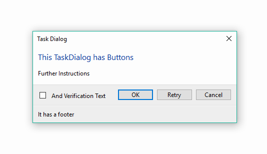
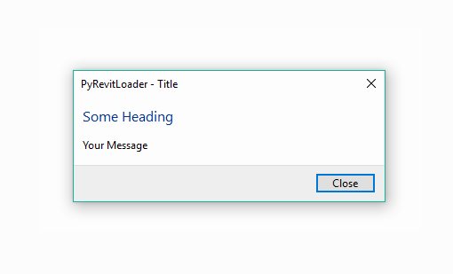
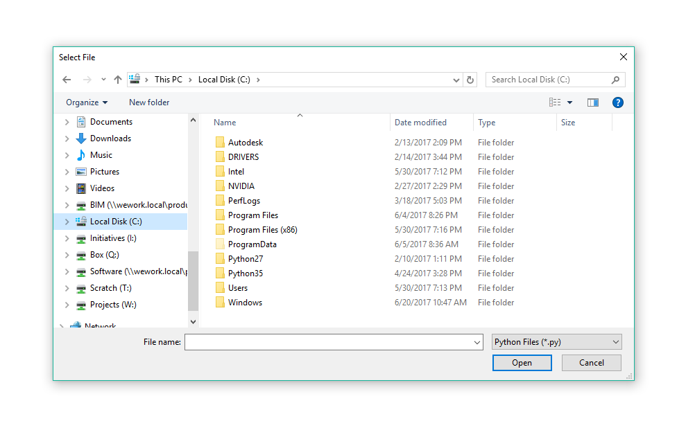
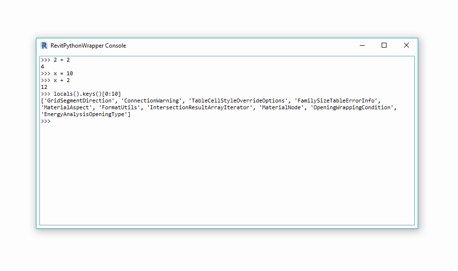

.. revitpythonwrapper documentation master file, created by
   sphinx-quickstart on Mon Oct 31 13:57:34 2016.
   You can adapt this file completely to your liking, but it should at least
   contain the root `toctree` directive.

==================
Forms
==================

.. automodule:: rpw.ui.forms
    :undoc-members:

**********
QuickForms
**********

SelectFromList
^^^^^^^^^^^^^^

.. image:: ../../_static/forms/select-from-list.png

.. autofunction:: rpw.ui.forms.SelectFromList

TextInput
^^^^^^^^^

.. image:: ../../_static/forms/text-input.png

.. autofunction:: rpw.ui.forms.TextInput

-------------------------------------------------------------------

***********
TaskDialogs
***********

TaskDialog
^^^^^^^^^^

.. autoclass:: rpw.ui.forms.TaskDialog
    :members:
    :special-members: __init__

.. autoclass:: rpw.ui.forms.CommandLink
    :members:
    :special-members: __init__

Alert
^^^^^

.. autoclass:: rpw.ui.forms.Alert
    :members:
    :special-members: __init__

-------------------------------------------------------------------

***********
OS Dialogs
***********

Select Folder
^^^^^^^^^^^^^

.. image:: ../../_static/forms/select_folder.png

.. autofunction:: rpw.ui.forms.select_folder

Select File
^^^^^^^^^^^^^

.. autofunction:: rpw.ui.forms.select_file

-------------------------------------------------------------------

********
Console
********

.. automodule:: rpw.ui.forms.console
    :undoc-members:

.. autoclass:: rpw.ui.forms.Console
    :special-members: __init__
    :private-members:

-------------------------------------------------------------------

********
FlexForm
********

.. autoclass:: rpw.ui.forms.FlexForm
  :members:
  :special-members: __init__

.. image:: ../../_static/forms/flexform.png

FlexForm Controls
^^^^^^^^^^^^^^^^^

.. autoclass:: rpw.ui.forms.Label
  :members:
  :special-members: __init__
.. autoclass:: rpw.ui.forms.TextBox
  :members:
  :special-members: __init__
.. autoclass:: rpw.ui.forms.CheckBox
  :members:
  :special-members: __init__
.. autoclass:: rpw.ui.forms.ComboBox
  :members:
  :special-members: __init__
.. autoclass:: rpw.ui.forms.Button
  :members:
  :special-members: __init__
.. autoclass:: rpw.ui.forms.Separator

-------------------------------------------------------------------

***************
Implementations
***************

FlexForm

.. literalinclude:: ../../../rpw/ui/forms/flexform.py
    :start-after: """  #

QuickForm

.. literalinclude:: ../../../rpw/ui/forms/quickform.py
    :start-after: """  #

TaskDialog

.. literalinclude:: ../../../rpw/ui/forms/taskdialog.py
    :start-after: """  #

OS Dialogs

.. literalinclude:: ../../../rpw/ui/forms/os_dialog.py
    :start-after: """  #

Console

.. literalinclude:: ../../../rpw/ui/forms/console.py
    :start-after: """  #

Resources

.. literalinclude:: ../../../rpw/ui/forms/resources.py
    :start-after: """  #

.. disqus
